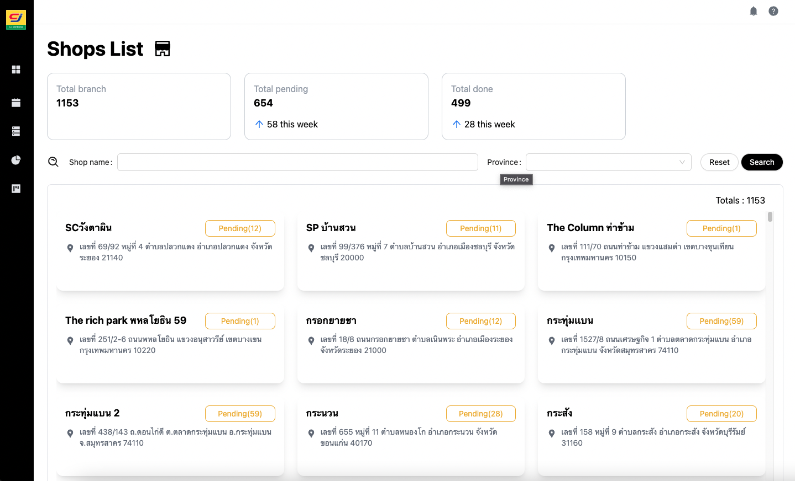

# CJ Homework Website

Welcome to the CJ Homework Website! This platform is dedicated to showcasing my assignment from CJ. The assignment entails creating a website capable of uploading pictures of shelves in convenient shops and providing the functionality to approve or reject these images directly on the platform.

The website is designed with responsiveness in mind to ensure compatibility across various devices.

## Usage

Feel free to explore the website by visiting [https://cj-homework-dc.vercel.app/](#)
If you wish to run this project locally, simply clone the repository and use the following command,

```shell
yarn
yarn dev
```

## Wireframe

To view the wireframe design, you can access it [here](https://www.figma.com/file/JUmZXCVeaB9ZxQ9ihvQfrO/CJ-Homework-Wireframe-Dhamachart-Chanprasartsuk?type=design&node-id=0%3A1&mode=design&t=T8UqzsmOJMV5Tisj-1).

## Screenshots



## Support/Contact

For any inquiries or to get in touch with me, please feel free to reach out via email: [dhamachart.c@gmail.com](mailto:dhamachart.c@gmail.com).

---

Thank you for visiting my website! Your support and interest are greatly appreciated.
